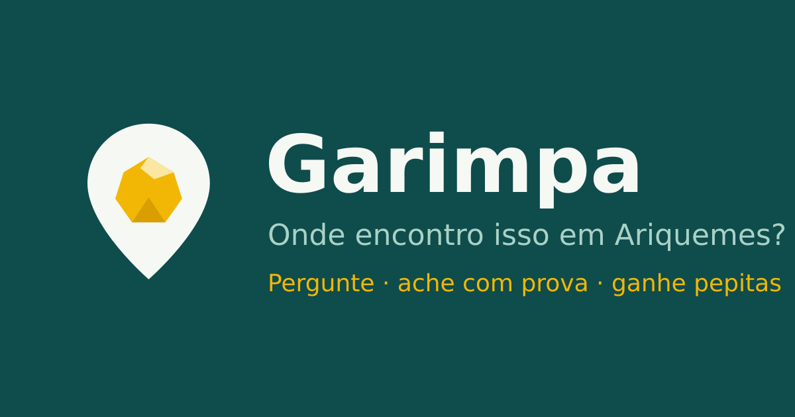
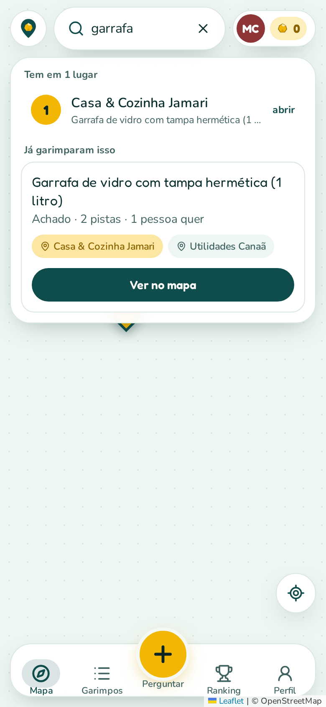
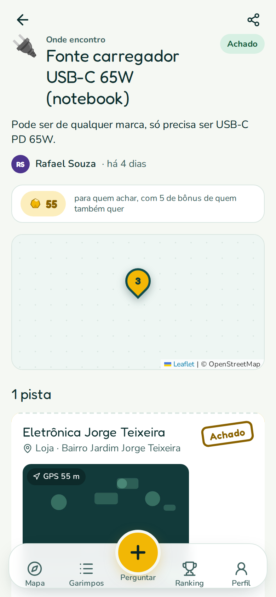
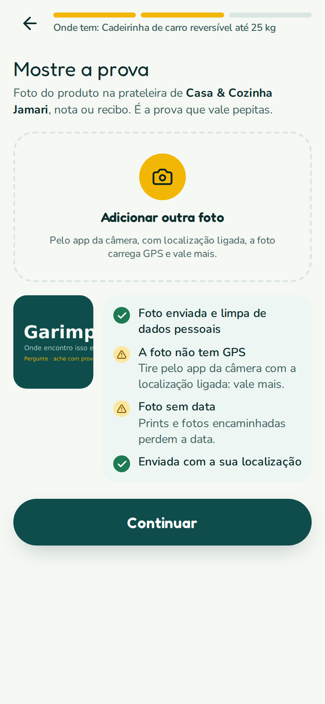
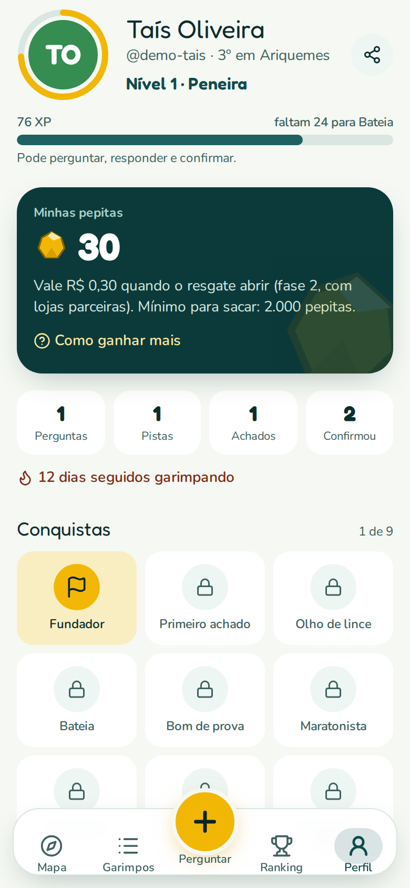
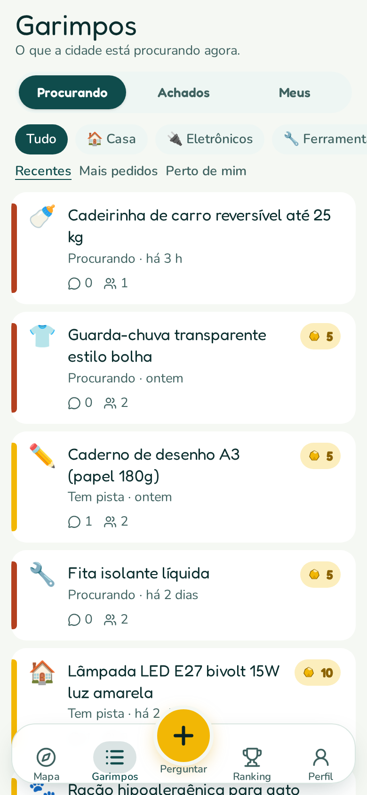
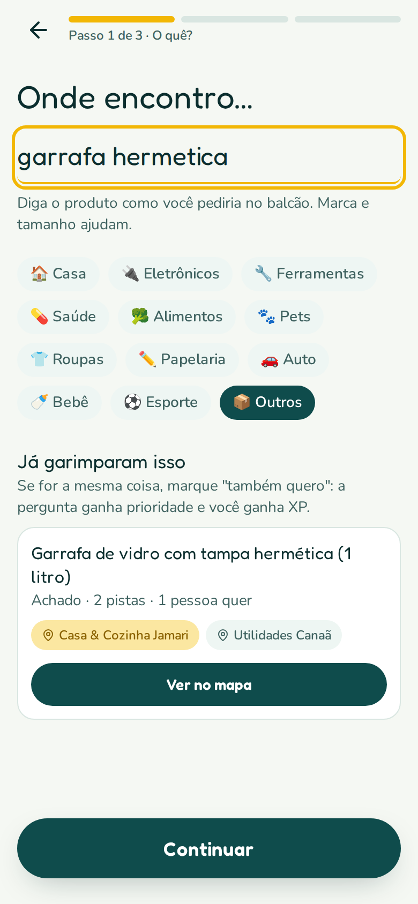
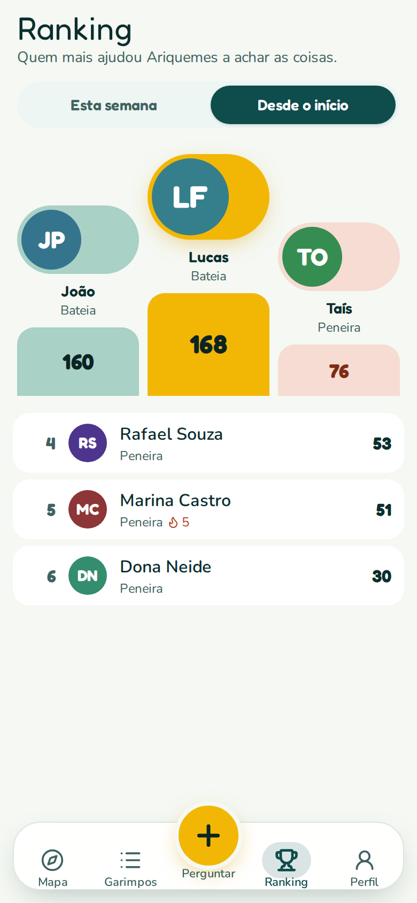
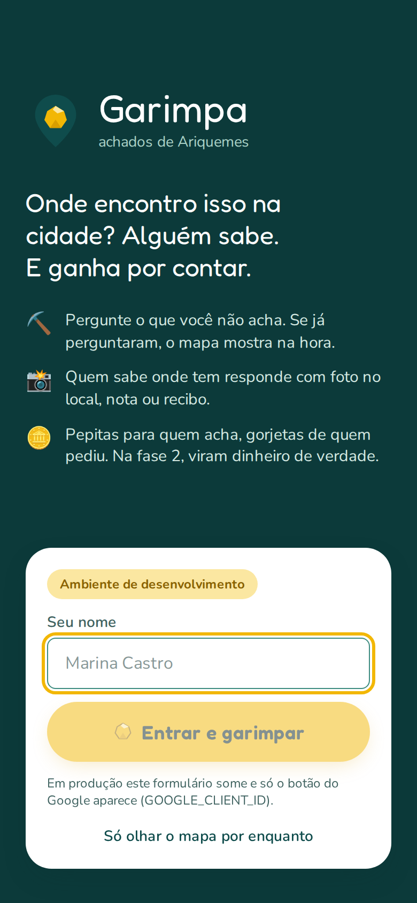

# Garimpa

<p align="center"></p>

**Onde encontro isso em Ariquemes?** Pergunte. Quem já viu o produto numa loja responde com foto no local. O mapa guarda a resposta para a próxima pessoa. Quem ajuda ganha pepitas.

PWA colaborativa e gamificada, piloto em Ariquemes-RO, da Incubadora de Software do IFRO. Sem loja de aplicativos: um link, login com Google, instala na tela inicial. Repositório próprio: `andreyquadros/garimpa.app.br`.

| Mapa com busca | Pergunta resolvida | Enviar prova | Perfil |
|---|---|---|---|
|  |  |  |  |

| Garimpos | Perguntar (dedupe) | Ranking | Entrar |
|---|---|---|---|
|  |  |  |  |

## Como funciona

1. **Buscar** no mapa (campo no centro). Se já tem achado, aparecem os pinos dourados e "como chegar". Se já perguntaram, dá para marcar "também quero". Se ninguém garimpou, perguntar leva três passos.
2. **Responder com prova**: foto do produto na prateleira (GPS da foto e a sua localização contam), nota ou recibo. Um checklist animado mostra na hora a força da prova.
3. **Confirmar**: duas pessoas confirmando no local validam a pista; quem perguntou aceita a que resolveu, com confete, e distribui gorjetas.
4. **Pepitas e XP**: XP mede reputação (níveis de Peneira a Guardião do mapa) e nunca vira dinheiro; pepitas nascem só de achados aceitos ou confirmados, ficam 7 dias em carência e, na fase 2, viram reais pelo Cofre das lojas parceiras.

## Documentação

| Documento | Conteúdo |
|---|---|
| [docs/00-visao-do-produto.md](docs/00-visao-do-produto.md) | problema, aposta, personas, métricas do piloto, riscos |
| [docs/01-dominios.md](docs/01-dominios.md) | nome **Garimpa**, domínios candidatos e verificados, como registrar |
| [docs/02-adr-banco-de-dados.md](docs/02-adr-banco-de-dados.md) | por que **PostgreSQL 16** auto-hospedado (e não Supabase, Firestore ou PocketBase) |
| [docs/03-gamificacao-arvore-de-pontos.md](docs/03-gamificacao-arvore-de-pontos.md) | XP × pepitas, tabela de eventos, níveis, conquistas, por que não onera cedo |
| [docs/04-antiplagio-e-confianca.md](docs/04-antiplagio-e-confianca.md) | primeiro achado, hash perceptual, EXIF, texto copiado, conluio, denúncias, carência |
| [docs/05-modelo-de-negocio.md](docs/05-modelo-de-negocio.md) | fase 1 (hábito), fase 2 (lojas parceiras e Cofre), fase 3, benchmark, LGPD |
| [docs/06-arquitetura-e-deploy.md](docs/06-arquitetura-e-deploy.md) | pastas, rodar local, deploy no KVM 8 com Dokploy, Google OAuth, operação |

## Stack

| Camada | Tecnologia |
|---|---|
| PWA | React 19, Vite 8, TypeScript, Tailwind 4, Motion, Leaflet (tiles próprios de Ariquemes), TanStack Query, vite-plugin-pwa |
| API | Node 22, Hono, Postgres.js, jose (Google ID token), sharp + exifr (provas), zod |
| Banco | PostgreSQL 16 com `earthdistance`, `pg_trgm`, `unaccent`, `tsvector('portuguese')`; livro-razão em PL/pgSQL |
| Deploy | uma imagem Docker (API serve o PWA e as fotos) + Postgres + backup, via Dokploy no KVM 8 |

## Rodar

```bash
pnpm install
scripts/local-postgres.sh start      # Postgres 16 local, sem Docker
pnpm db:migrate && pnpm db:seed      # esquema + dados de demonstração
pnpm dev                             # http://localhost:5173 (API em :8787)
pnpm --filter garimpa-api test       # testes contra o Postgres local
```

Sem `GOOGLE_CLIENT_ID` o app oferece login de desenvolvimento: entre como `marina` para ver uma conta com histórico.

## Estado

Piloto funcional, pronto para subir no KVM 8: mapa com busca e deduplicação, perguntar, responder com prova e checklist, confirmações ponderadas, aceite com gorjeta, ranking semanal e geral, perfil com níveis e conquistas, antiplágio (hash perceptual, EXIF, texto, conluio, denúncias) e livro-razão com carência e estorno. Fora do escopo desta entrega: notificações push, painel do lojista e resgate via Pix (fase 2).
